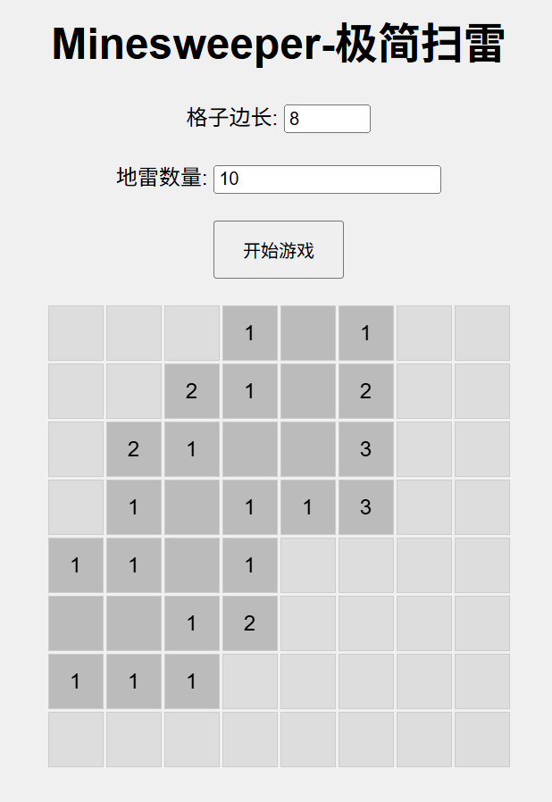

# Minesweeper

Welcome to Minesweeper! This project is a browser-based implementation of the classic Minesweeper game using HTML, CSS, and JavaScript. Customize your game experience by selecting the field size and number of mines.  
欢迎来到扫雷游戏！这个项目是一个基于浏览器的经典扫雷游戏的实现，使用了HTML、CSS和JavaScript。通过选择字段大小和地雷数量来定制你的游戏体验。
  
## 汉化说明

当前汉化仅适用于 版本：

首先感谢原作者的开源。[原项目地址]()

具体汉化了那些内容，请参考[翻译说明](./翻译说明.md)。

我看不懂代码，所以只做汉化，有问题，请到原作者仓库处反馈。

本人提供这个项目在 NAS、服务器等的有偿远程部署服务，有需要可联系。  
微信号 `E-0_0-` 二维码在最后  
闲鱼搜索用户 `明月人间`  
或者邮箱 `firfe163@163.com`  
如果这个项目有帮到你。欢迎start。

有其他的项目的汉化需求，欢迎提issue。或其他方式联系通知。

### 部署汉化项目

1. 从阿里云或华为云镜像仓库拉取镜像，注意填写镜像标签，镜像仓库中没有`latest`标签

   ```bash
   crpi-aiy5xfxuied4b3f9.cn-chengdu.personal.cr.aliyuncs.com/firfe/minesweeper:2025.04.15
   ```

2. 部署  
   容器端口3000
     - 命令部署

       ```bash
       docker run -d \
       --name minesweeper \
       --network bridge \
       --restart always \
       --log-opt max-size=1m \
       --log-opt max-file=3 \
       -p 3000:3000 \
       crpi-aiy5xfxuied4b3f9.cn-chengdu.personal.cr.aliyuncs.com/firfe/minesweeper:2025.04.15
       ```

     - `compose.yaml`文件部署 👍推荐

       ```yaml
       #version: '3.9'
       services:
         minesweeper:
           container_name: minesweeper
           image: crpi-aiy5xfxuied4b3f9.cn-chengdu.personal.cr.aliyuncs.com/firfe/minesweeper:2025.04.15
           network_mode: bridge
           restart: always
           logging:
             options:
               max-size: 1m
               max-file: '3'
           ports:
             - 3000:3000
       ```

## 修改说明

这里对除了汉化之外的代码修改的说明。  
增加修改部分具体见 [修改说明](./修改说明.md)。

`./README.md` 文件翻译，增加 `## 汉化说明`、`## 修改说明`、`## 汉化效果截图`、`## 我的二维码` 部分。

增加目录 `./图片`
新增文件 `./.dockerignore`、`./Dockerfile`、`./翻译说明.md`

## 汉化效果截图



## Play the Game 开始游戏

[开始玩 Minesweeper!](https://freeopensourcegames.github.io/minesweeper/index.html)

## Features 特性

- **Customizable Gameplay**: Choose your grid size and number of mines.  
  可自定义的游戏玩法：选择你的网格大小和地雷数量。
- **Winning and Losing Conditions**: Alerts when you clear the board or hit a mine.  
  胜利和失败条件：清理完棋盘或触雷时会有提示。
- **Responsive Design**: Playable on both desktop and mobile devices.  
  响应式设计：可在桌面设备和移动设备上游戏。

## How to Play 如何游戏

1. **Objective**: Clear the board without triggering any mines.  
   目标：在不触发任何地雷的情况下清除棋盘。
2. **Controls 控制方式**:
   - Click a cell to reveal it.  
     单击一个单元格以揭示它。
   - Press a cell long to flag it.  
     长按一个单元格以标记旗帜。
3. **Winning**: Reveal all safe cells to win the game.  
   胜利：揭示所有安全的单元格即可获胜。
4. **Losing**: Clicking on a mine will end the game.  
   失败：单击地雷将结束游戏。

## Setup 设置

To run the game locally, clone this repository and open `index.html` in your browser:  
要在本地运行游戏，克隆此仓库并在浏览器中打开index.html。

```bash
git clone https://github.com/freeopensourcegames/minesweeper.git
cd minesweeper
open index.html
```

Or use your preferred method to open the `index.html` file in any web browser.  
或者使用你喜欢的方法在任何网页浏览器中打开index.html文件。

## Contributing 贡献

We welcome contributions!  
我们欢迎贡献！

Feel free to create a PR with your ideas to improve this small game.  
随时可以创建一个包含你的改进建议的PR（Pull Request）。

Please ensure any pull requests follow the coding style used in the project.  
请确保所有拉取请求都遵循项目中使用的编码风格。

## License 许可证

This project is licensed under the MIT License - see the [LICENSE](LICENSE) file for details.  
本项目基于MIT许可证 - 详情请参见[LICENSE](LICENSE)文件。

## Contact 联系方式

If you have any questions or suggestions, feel free to reach out!  
如果你有任何问题或建议，欢迎随时联系我们！
